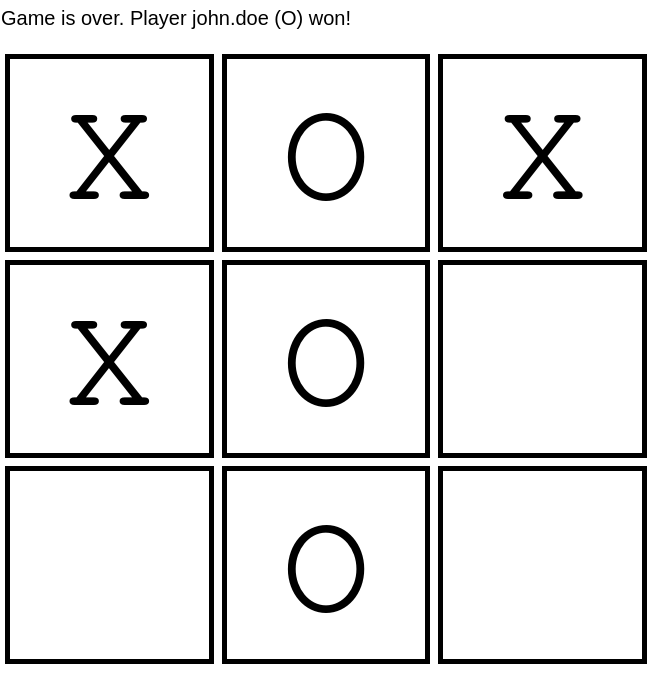

# Tic-Tac-Toe in Django

## Introduction



This is a barebones implementation of the [Tic-Tac-Toe game](https://en.wikipedia.org/wiki/Tic-tac-toe) using the Django framework. The web application allows users to create start a new game, join an open game, and play together on a board until one of the players wins or the game end in a tie.

My idea with this exercise is to learn Django and practice Python along the way. The end result does not look fancy, but it does its job :) It even uses some HTMX here and there to implement the interactive bits of the game.

The code is heavily based on the official [Django tutorial](https://docs.djangoproject.com/en/5.0/intro/tutorial01/) for Django 5.0 and the [Mozilla Django Tutorial](https://developer.mozilla.org/en-US/docs/Learn/Server-side/Django/Authentication) for the authentication part.

## Features

- User authentication and authorization
- HTMX requests
- Django templates 
- Django testing framework

## How to set up

You need python (at least 3.10) and pipenv in your system. Open a terminal and from the project directory run the following command:
```bash
pipenv install
```

This should install all dependencies. After that you have to prepare the database:
```bash
python game/manage.py migrate
```

And then create a superuser:
```bash
python game/manage.py createsuperuser
```

You can now start the server:
```bash
python game/manage.py runserver
```

And log in with your super user credentials in the admin area, usually at http://127.0.0.1:8000/admin/ (look at the output of `runserver` to know the exact address and port where the server is running).

In the admin area you can create a couple of users. After that you can log out and enter the game web site at http://127.0.0.1:8000/tictactoe. Log in with one of the users you have created and create a couple of boards. 

Log out and log in again as a different user. Join the boards you have just created with the first user.

You can also open two different browsers and log in on each one with a different user. You can play on both browsers and see how the board automatically updates! :)

## License

All the code that is not part of any library (like HTMX) is part of the public domain. The software is offered "as is", without any guarantee.